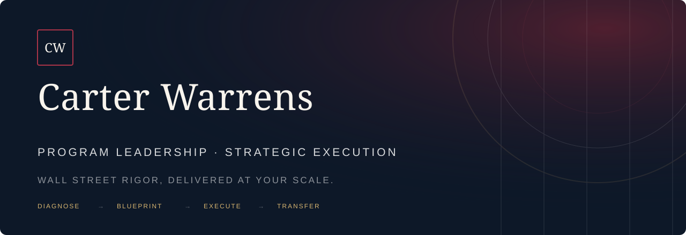

<p align="center">
  <a href="https://www.carterwarrens.com">
    
  </a>
</p>

<p align="center">
  <a href="https://www.carterwarrens.com"><strong>Firm</strong></a>
  &nbsp;·&nbsp;
  <a href="https://www.carterwarrens.com/#services"><strong>Services</strong></a>
  &nbsp;·&nbsp;
  <a href="https://www.carterwarrens.com/#approach"><strong>Approach</strong></a>
  &nbsp;·&nbsp;
  <a href="https://www.carterwarrens.com/#selected-work"><strong>Selected work</strong></a>
  &nbsp;·&nbsp;
  <a href="mailto:ceo@carterwarrens.com"><strong>Work with us</strong></a>
</p>

## Wall Street rigor, delivered at your scale

Carter Warrens is a boutique consulting and strategic-execution firm. We bring senior program leadership, operating discipline, and institutional-grade governance to growth-stage companies, private funds, public-sector organizations, and teams navigating consequential change.

Our public engineering work is where the method becomes inspectable: define the problem precisely, build the system, expose the controls, test the failure modes, and document what survives.

> **Diagnose clearly. Govern deliberately. Execute with discipline. Transfer what works.**

## Selected work

| Initiative | Status | Purpose | Entry point |
|---|---|---|---|
| **BLAQUE BAUX** | **Live** | Open systematic research, portfolio construction, derivative analysis, and governed execution | [Research platform](https://www.blaquebaux.com) · [GitHub](https://github.com/blaquebaux) |
| **ROSPlus** | **Built / testing** | A ROS 2 add-on control plane for deterministic execution, compatibility, and fail-safe robotics | [`Carter-Warrens/ROSPlus`](https://github.com/Carter-Warrens/ROSPlus) |
| **AGI-LE** | **UAT / SIT** | A local-first, inspectable framework for governed agentic work and authorized task movement | [Preview AGI-LE](https://www.agi-le.com) |
| **Publications** | **Editorial** | Original frameworks and long-form thinking on risk, institutions, technology, governance, and human agency | [`Carter-Warrens/publications`](https://github.com/Carter-Warrens/publications) |

## How we build

```text
DIAGNOSE  →  BLUEPRINT  →  EXECUTE  →  TRANSFER
    ↓              ↓            ↓            ↓
 evidence      decision      governed      durable
  before        rights        delivery     capability
 narrative
```

- **Clarity before activity** — isolate the constraint and define the decision.
- **Governance by design** — make ownership, escalation, controls, and evidence explicit.
- **Compatibility over disruption** — improve systems without discarding what already works.
- **Failure-aware engineering** — design for degraded states, safe boundaries, and honest testing.
- **Capability transfer** — leave clients and collaborators with systems they can operate.

## Public repositories

Public repositories will appear here as they clear their documentation, testing, security, and release gates. Until transfer is complete, current public work remains available under [`Carter-Warrens`](https://github.com/Carter-Warrens).

## Work with Carter Warrens

If an important initiative is stalled between strategy and execution, tell us the objective, the constraint, the principal stakeholders, and the timing that matters.

**[ceo@carterwarrens.com](mailto:ceo@carterwarrens.com)** · **[carterwarrens.com](https://www.carterwarrens.com)**

<sub>Carter Warrens is a consulting and strategic-execution firm. BLAQUE BAUX publishes educational research and software; it does not provide personalized investment advice or represent itself as a broker-dealer, fund, or asset manager.</sub>
